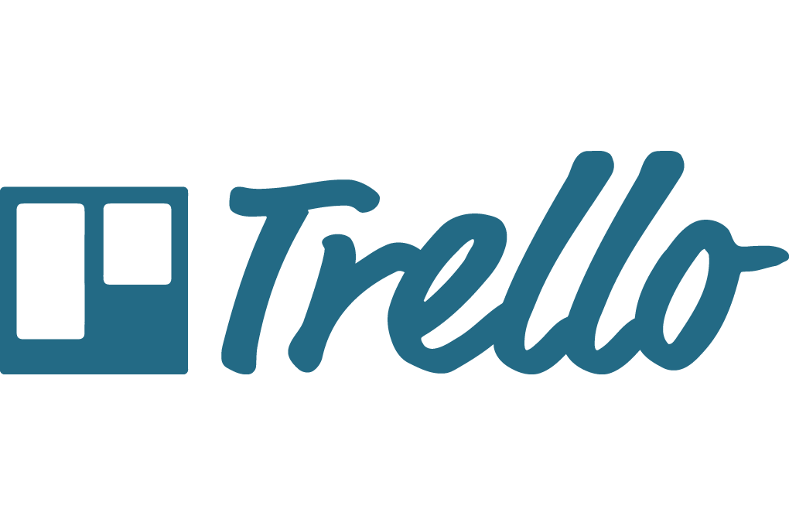

# Ferramentas: 

As ferramentas utilizadas para realização desse projeto estão divididas nos seguintes grupos: Comunicação, Organização e Prototipação. Cada grupo está detalhado abaixo.

## Ferramentas de Comunicação:

* Telegram: Para reuniões e troca de informações assíncronas.

* Discord: Para reuniões síncronas e realização de trabalhos em grupo.

* Microsoft Teams: Para reuniões síncronas e gravações de apresentações.

## Ferramentas de Organização:

* Github: Para controle do versionamento do projeto e colaboração dos participantes.

* Trello: Para definição de datas, tarefas e planejamento do projeto.

## Ferramentas de Prototipação:

* Figma: Para elaboração de protótipos visuais de telas.

## Histórico de Versões:

|Data|Descrição|Versão|Autor(es)|
|----|---------|------|---------|
|19/09/2020| Criação do documento com a lista de ferramentas utilizadas| 0.1|Murilo Gomes e Gabriel Paiva|
