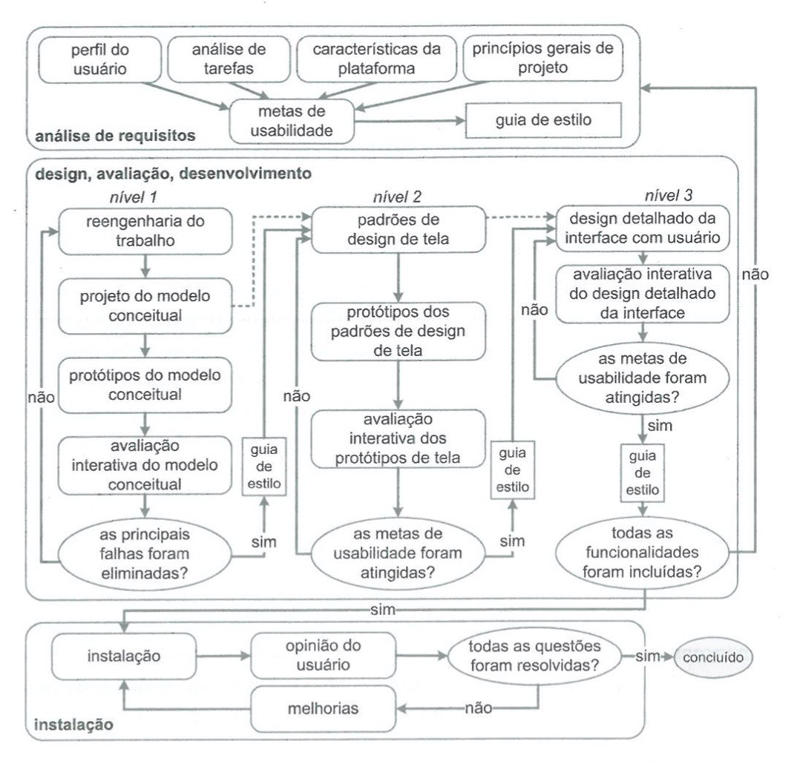

# Processo de Design:
Para efetuar o processo de design do projeto, a equipe decidiu utilizar o **Ciclo de Vida de Mayhew**.

## Ciclo de Vida de Mayhew:
O Ciclo Mayhew é dividido em três fases:
* **Análise de requisitos:** São definidas as metas de usabilidade de acordo com o perfil dos usuários, análise de tarefas, possibilidades e limitações da plataforma.
* **Design, avaliação e desenvolvimento:** Concebe a solução de IHC que atenda as metas de usabilidade estabelecidas.
* **Instalação:** Coleta de opiniões de usuários depois de algum tempo de uso, com o objetivo de melhorar o sistema.

Esse método foi escolhido por apresentar alta iteratividade em seus passos, evitando uma boa quantidade de problemas no produto final.

## Histórico de Versões:

|Data|Descrição|Versão|Autor(es)|
|----|---------|------|---------|
|19/09/2020| Criação do documento com a descrição do processo escolhido| 0.1|Murilo Gomes e Gabriel Paiva|

